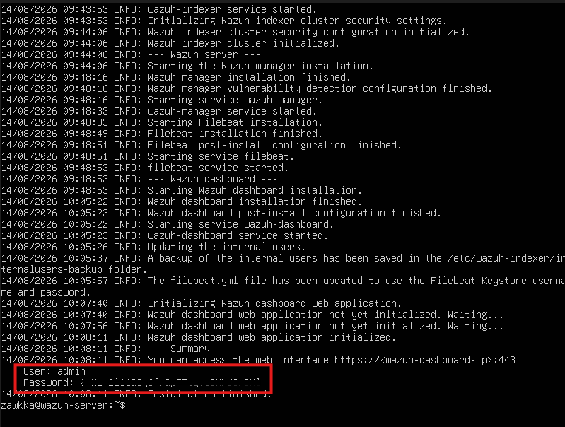
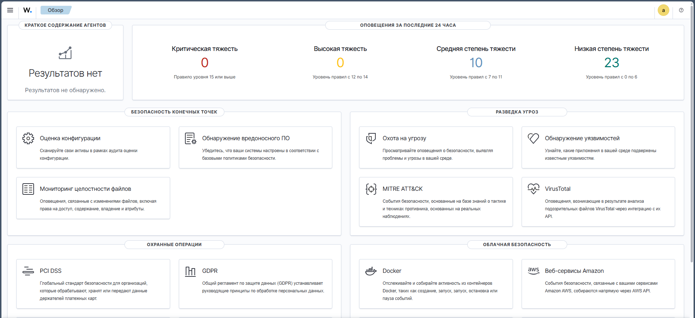
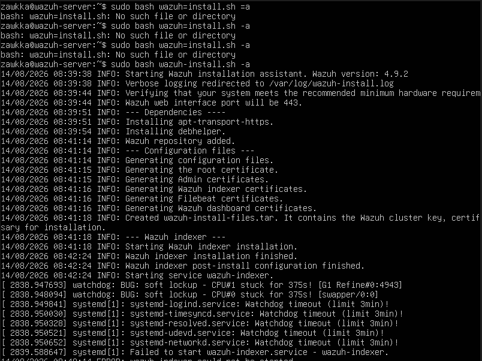

# Установка SIEM-системы Wazuh на Ubuntu Server в VirtualBox
Практическое руководство по развёртыванию Wazuh, с разбором неочевидных багов консоли и проблемой ресурсов, для тех, у кого не всё "как по маслу"

# 🛠️ Окружение
1. **Гипервизор:** VirtualBox
2. **Гостевая ОС:** Linux Ubuntu Server 24.04 LTS
3. **Сеть:** Сетевой мост (Bridge)

# Часть 1. Установка Wazuh
# 🚀 Пошаговый процесс установки

### Этап 1. Пошаговый процесс установки и баги консоли

При первом входе в Ubuntu Server пароль вводится **вслепую**(на экране не отображаются даже звёздочки)

**Важно (фикс уплывающей строки):** Если консоль VirtualBox забаговалась и строка уплыла из зоны видимости, воспользуетесь сочетанием клавишей **Ctrl + L** или вслепую введите команду **clear**, это очистит терминал, и позволит вернуть строку в рабочую зону. 

### Этап 2. Скачивание официального скрипта
Для скачивания используем утилиту `curl`.
```bash
curl -sO  https://packages.wazuh.com/4.x/wazuh-install.sh
```
**В конце флага -sO, заглавная буква O, а не цифра 0!**


### Этап 3. Установка и развёртывание Wazuh

Для развёртывание системы используем команду:
```bash
sudo bash wazuh-install.sh -a
```
По окончанию установки, вам выдадут логин и пороль, а также адрес главного веб интерфейса:



Вводим полученные данные и попадаем на главную страницу wazuh:



### Этап 4. Развертывание агента и подключение хоста (GUI)
Поиск кнопки добавления агента в обновленном интерфейсе Wazuh 4.9 — это отдельный квест. 

**Маршрут для нахождения заветной кнопки в GUI:**
Левое меню -> **Управление серверами** (Server management) -> **Краткое описание конечных точек** (Endpoints Summary). Именно там находится кнопка `Развернуть новый агент` (Deploy new agent).


Выбираем ОС главного хоста и вводим адрес wazuh-сервера, после генерации команды в конструкторе, запускаем PowerShell от имени администратора на целевом хосте Windows, вводим созданную команду и активируем службу:
```powershell
Start-Service -Name Wazuh
```
После обновления страницы статус хоста триумфально меняется на **Active (1)**. Система запущена и собирает логи в реальном времени.


## ❌ Troubleshooting (поиск неисправностей и их решение)

### Проблема 1. Падения установки на Wazuh Indexer (Watchdog timeout)


* Решение 1. Выключить ВМ, и выделить ей минимум **4-8гб RAM** и **2-4 ядра CPU**
* Решение 2. Принудительно увеличить системный таймаут ожидания сервиса до 15 минут одной командой:
```bash
sudo mkdir -p /etc/systemd/system/wazuh-indexer.service.d && echo -e "[Service]\nTimeoutStartSec=900" | sudo tee /etc/systemd/system/wazuh-indexer.service.d/override.conf
```
После этого перезапустить установку командой:
```bash
sudo bash wazuh-install.sh -a
```


